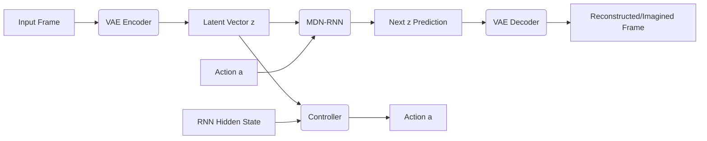

# World Models for Self-Driving Simulation

[](https://www.python.org/downloads/)
[](https://pytorch.org/)
[](https://opensource.org/licenses/MIT)

A complete implementation of a **World Model (VAE-MDN-RNN-Controller)** designed to simulate and "dream" self-driving car dynamics. This project demonstrates how neural networks can learn a compressed representation of a visual environment and predict future states based on actions.

## 🚀 Overview

Inspired by the paper ["World Models"](https://worldmodels.github.io/) (Ha & Schmidhuber, 2018), this project implements a pipeline where:
1. **VAE (Vision):** Compresses high-dimensional 64x64 input frames into a compact 32D latent space.
2. **MDN-RNN (Dynamics):** Predicts the next latent state (next frame) given the current state and action using a Mixture Density Network (MDN).
3. **Controller (Behavior):** Learns the optimal steering actions based on the latent space and RNN hidden states.

## 🏗️ Architecture



## ✨ Key Features

- **4K Imagination Video:** The model can "dream" driving sequences by recursively predicting future frames, upscaling them to 4K resolution with a custom "Self-Driving UI" overlay.
- **Synthetically Generated Dataset:** Uses a custom Procedural Driving Simulator to generate training data (lanes, obstacles, and car dynamics).
- **Mixture Density Network:** Robustly handles stochasticity in the environment by predicting a distribution of possible future states.

## 🛠️ Setup & Training

### 1. Requirements
```bash
pip install -r requirements.txt
```

### 2. Run Training
The script `train.py` handles the full pipeline:
- Generates synthetic driving data.
- Trains the VAE for visual representation.
- Trains the MDN-RNN for environment dynamics.
- Generates a 4K "Imagination" video showcase.

```bash
python train.py
```

## 📺 Showcase

The project generates a high-quality visualization of the World Model's "imagination". The video `imagination_4k.mp4` shows the model predicting the road and obstacles purely through its learned internal representation.

## � Future Roadmap & Improvements
To evolve this baseline world model into a production-grade system, the following enhancements are planned:
- **Architectural Shift:** Replace the LSTM-based MDN-RNN with a **Categorical Reparameterization (RSSM)** or a **Temporal Transformer** for better long-horizon stability.
- **Visual Fidelity:** Transition from a simple VAE to a **VQ-GAN** or **Diffusion-based** decoder to eliminate blurriness in high-resolution "imagination" steps.
- **Perceptual Loss:** Integrate **LPIPS** loss into the VAE training to focus on structural details rather than just pixel-wise reconstruction.
- **Environment Complexity:** Move from 2D procedural rendering to a **3D Unreal Engine/CARLA** integration for realistic sensor simulation.

## �📄 License
This project is licensed under the MIT License - see the [LICENSE](LICENSE) file for details.
